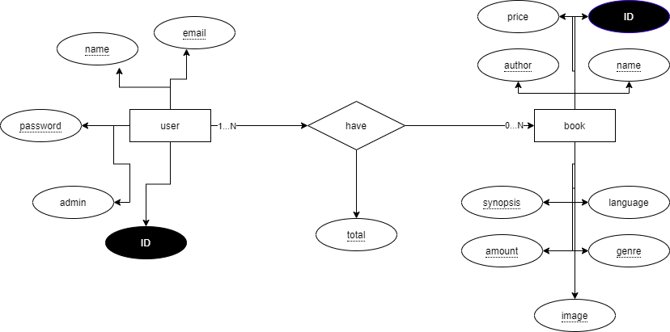

# Book-Point

Um projeto de livraria online, para encerramento do 3° ano no IFRS, remodelado em 2020.

Tecnologias utilizadas para criação da aplicação:

- PHP
- PostgresSQL

Link do projeto: https://bk-point.herokuapp.com{:target="_blank"}

## REQUISITOS FUNCIONAIS

https://docs.google.com/document/d/1xKc3oBkYuAmbsjqR4AIBmHPJlgFMo0TIc2OxjI1lkZ4/edit?usp=sharing

## SKETCH DAS TELAS

Sketch produzido em conjunto com [Silvio Quintana](https://github.com/SilvioGQ){:target="_blank"}

https://www.figma.com/file/g30sl7aicL6Zw7Br08yokD/BookPoint?node-id=0%3A1

## MAPEAMENTO DO BANCO

